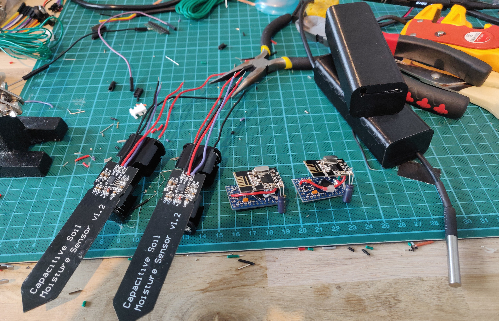
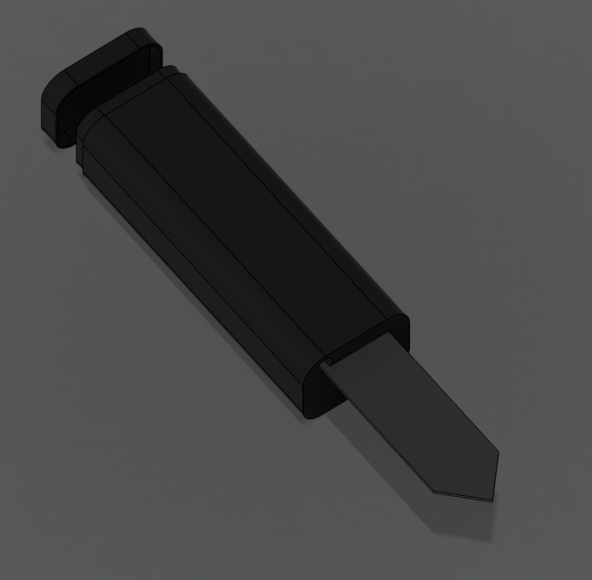

# AutoGarden
Automation of plants

## Sensor
Moisture and Temperature sensor. Low power, wakes up every 30 min and sends data to the NRF24 Gateway.
Arduino Pro Mini 3.3V@8MHz with voltage regulator and leds removed to achieve minimal current consumption.

  
  

## NRF24 Gateway
Receives data from the Sensors and passes the data on to [OneBackendToRuleThemAll](https://github.com/jakkra/OneBackendToRuleThemAll).
Just an ESP8266 with a NRF24 transceiver.

## WaterSystem
Controls a water pump in a water container and starts it when told to.

